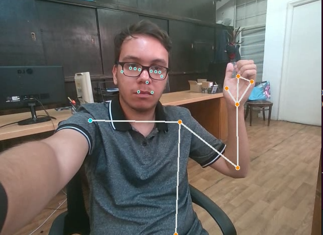
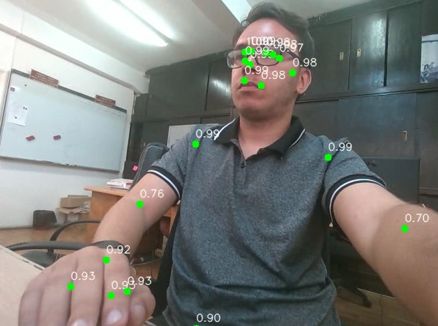

<h1> BodyMarks Media Pipeline with Confidence Scores - DL Python Project</h1>
 
<h2>Features</h2>
<ul>
    <li>bodymarks_pipeline.py: program to show body marks on a human being</li>
    <li>bodymarks_pipeline_with_confidence.py: program to show confidence scores on the body</li>
    <li>bodymarks_pipeline_with_confidence_DL.ipynb: model training and accuracy of the model and media pipeline</li>
</ul>

<h2>Acknowledgments</h2>

<b> Python3: http://bit.ly/python3-certifications </b>
 
<b> Machine Learning: https://bit.ly/machine-learning-certification <b>
 

<h2>Photo</h2>
<h4>BodyMarks</h4>

 
<h4>BodyMarks with Confidence Scores</h4>

 
<h2>Contact</h2>

<b> Email: mariusc0023@gmail.com </b>
